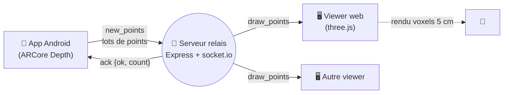

# Scan3D — reconstruction 3D en temps réel

Serveur relais **WebSocket** + **viewer web** three.js pour visualiser, en direct, un
nuage de points 3D capturé par un smartphone. Le téléphone filme une scène, en extrait
des points colorés via l'API de profondeur d'ARCore, et les envoie au serveur ; tout
navigateur connecté voit le nuage se construire et peut tourner autour.

Ce dépôt contient **le serveur et le viewer**. L'application Android de capture vit dans
un dépôt séparé — voir [Application Android](#application-android).

> Fork de [Oursel06/scan3d](https://github.com/Oursel06/scan3d), enrichi pour un
> hébergement autonome : authentification par token, envoi par lots, format binaire,
> et outillage de déploiement. La branche `main` suit l'amont ; tout l'ajout vit sur
> **`main-m29`** (branche par défaut de ce fork).

---

## Vue d'ensemble

Trois composants, un seul rôle pour le serveur : **relayer**, sans rien stocker.



- **L'app** émet l'événement `new_points` avec un lot de points `{x, y, z, r, g, b}`.
- **Le serveur** rediffuse chaque lot en `draw_points` à tous les *autres* clients
  authentifiés, et renvoie un accusé de réception `{ok, count}`.
- **Le viewer** agrège les points en voxels et affiche le nuage, navigable à la souris.

Le serveur est **sans état** : rien n'est persisté, un client qui arrive après coup ne
voit que ce qui est émis à partir de sa connexion.

---

## Comment ça marche

### Protocole socket.io

| Sens | Événement | Charge utile | Réponse |
|---|---|---|---|
| App → serveur | `new_points` | tableau de points (voir formats) | ack `{ok: true, count: N}` |
| Serveur → viewers | `draw_points` | le lot, tel quel | — |

Le serveur ne rediffuse qu'aux membres de la room `viewers` **autres que l'émetteur** :
un client ne reçoit jamais ce qu'il a lui-même envoyé.

### Formats de points

Le viewer accepte deux encodages, au choix de l'émetteur :

**JSON** — lisible, le plus simple :
```json
[{ "x": 0.12, "y": -0.03, "z": 1.8, "r": 200, "g": 180, "b": 150 }, …]
```

**Binaire** — ~4× plus compact (15 octets/point contre ~48), petit-boutiste :
```
[uint32 N][float32 x,y,z × N][uint8 r,g,b × N]
```

Coordonnées en **mètres**, couleurs sur **0–255**. Repère main droite, +Y vers le haut,
−Z vers l'avant (identique à three.js).

---

## Démarrage rapide

```bash
npm install
SCAN3D_TOKEN=$(openssl rand -hex 24) npm start
# → viewer sur http://localhost:3000/?k=<le-token-affiché>
```

Le serveur **refuse de démarrer sans `SCAN3D_TOKEN`** : c'est volontaire, pour ne jamais
exposer un relais ouvert par accident.

---

## Configuration

Tout passe par l'environnement (aucune valeur sensible dans le code) :

| Variable | Défaut | Rôle |
|---|---|---|
| `SCAN3D_TOKEN` | *(requis)* | Secret partagé. Sans lui, le serveur ne démarre pas. |
| `PORT` | `3000` | Port d'écoute. |
| `HOST` | `0.0.0.0` | Mettre `127.0.0.1` derrière un reverse proxy. |
| `SCAN3D_ORIGINS` | `https://scan3d.cube3d.fr` | Origines CORS autorisées (navigateurs). Sans effet sur un client natif. |
| `SCAN3D_MAX_BATCH_MB` | `32` | Taille max d'un lot. **Ne pas descendre à 1** (voir dépannage). |
| `SCAN3D_OPEN_INGEST` | *(absent)* | `true` = accepter les émetteurs sans token (voir sécurité). |

---

## Sécurité et modèle d'accès

Le token protège **la page web** et **le handshake socket.io**. Il est accepté via
`?k=<token>` dans l'URL, un cookie posé au premier chargement, l'en-tête
`X-Scan3d-Token`, `Authorization: Bearer`, ou le champ `auth.token` du handshake.

Deux modes, selon `SCAN3D_OPEN_INGEST` :

| Client | strict *(défaut)* | ingestion ouverte |
|---|---|---|
| **avec** token | émet **et** reçoit | émet et reçoit |
| **sans** token | rejeté (`unauthorized`) | **émet seulement — ne reçoit aucun scan** |

L'ingestion ouverte sert quand un émetteur ne peut pas transmettre de token (p. ex. une
app dont l'adresse est figée) : il peut publier, mais ne rejoint pas la room `viewers`,
donc ne voit jamais les scans. Compromis : un tiers connaissant l'adresse pourrait
injecter des points parasites, sans jamais pouvoir observer la capture.

> Le token ne doit jamais être commité. En production il vit dans un fichier
> d'environnement hors dépôt (voir [`deploy/.env.example`](deploy/.env.example)).

---

## Le viewer web

Rendu three.js : chaque point est aggloméré dans un **voxel** (cube de 5 cm par défaut),
avec moyenne des couleurs, occlusion ambiante et masquage des faces internes.

| Interaction | Effet |
|---|---|
| Souris / doigt | Orbite, zoom, panoramique |
| Touche **R** | Recadre la vue sur le nuage |
| Touche **C** | Efface le nuage |
| `?voxel=0.03` | Taille de voxel en mètres (ici 3 cm) |
| `?k=<token>` | Jeton d'accès |

---

## Client de test

`tools/e2e.js` remplace l'app pour valider la chaîne de bout en bout — sans téléphone :

```bash
SCAN3D_TOKEN=<token> npm run e2e -- https://votre-serveur
SCAN3D_TOKEN=<token> npm run e2e -- https://votre-serveur --polling
```

Il vérifie que la page exige le token, qu'un émetteur sans token ne reçoit aucun scan,
puis que `new_points` est bien relayé en `draw_points` entre deux clients.

> **Piège de diagnostic.** Le handshake **Engine.IO**
> (`GET /socket.io/?EIO=4&transport=polling`) renvoie un `sid` *même sans token* : c'est
> la couche transport. Le rejet a lieu à la connexion **Socket.IO** juste après. Ne pas
> conclure à une faille avec un simple `curl` — utiliser `tools/e2e.js`.

---

## Déploiement (instance `scan3d.cube3d.fr`)

Cette section documente le déploiement de référence ; elle est propre à cette instance.

```
DNS (wildcard) → box :443 → reverse proxy TLS → workstation :80 (Caddy) → 127.0.0.1:3017
```

- Service **systemd** `scan3d.service`, port **3017**, `HOST=127.0.0.1`.
- Déploiement : `ops/m29 deploy scan3d` — rollback : `m29 rollback scan3d`.
  Config dans [`deploy/`](deploy) : `m29.conf`, unité systemd, snippets Caddy
  (workstation **et** Pi frontal), `.env.example`.
- **Diffusion de l'APK** : la route `GET /apk` sert le fichier
  `shared/scan3d.apk` (hors dépôt), derrière le même token — installation sur le
  téléphone sans câble ni adb.

### Différences avec l'amont

| Modification | Pourquoi |
|---|---|
| `auth.js` (nouveau) | Gate par token : page **et** handshake socket.io. |
| `maxHttpBufferSize` réglable | Lève la limite de 1 Mo (voir dépannage). |
| `HOST` configurable | `127.0.0.1` derrière le proxy plutôt que `0.0.0.0`. |
| Route `/` explicite | Remplace `express.static(__dirname)`, qui exposait `package.json`, `node_modules`, et le `.env.local` symlinké. |
| CORS restreint | `SCAN3D_ORIGINS` au lieu de `*`. |
| Room `viewers` | Sépare émission et réception (base de l'ingestion ouverte). |

Récupérer les mises à jour de l'amont :
```bash
git fetch upstream && git merge upstream/main
```

---

## Dépannage

**L'app reste sur « connexion… » et rien ne s'affiche.** Presque toujours la limite de
taille : socket.io plafonne un message à **1 Mo par défaut** (~16 000 points), et
au-delà **ferme la connexion sans erreur applicative**, ce qui fait boucler le client.
D'où `SCAN3D_MAX_BATCH_MB` (32 Mo) et des lots de ~4000 points côté app.

**Le relais marche en WebSocket mais pas en long-polling.** Si le trafic LAN ressort et
rentre par la box (hairpin NAT), le long-polling se dégrade (le GET en attente est clos
par un ping au lieu des données) alors que le WebSocket passe. L'app privilégie donc
`['websocket', 'polling']`.

**Le compteur « envoyé » reste à 0 en mode binaire.** L'ack `count` est calculé sur un
tableau JSON ; un lot binaire doit être compté via l'en-tête `uint32`.

---

## Application Android

La capture (ARCore Depth → nuage coloré, envoi par lots, affichage AR) est un projet
Kotlin distinct : **[scan3d-android](https://github.com/escolar35-JE/scan3d-android)**.
Elle permet de saisir l'URL du serveur et le token, et gère les deux formats d'envoi.

---

## Structure du dépôt

```
server.js                 relais Express + socket.io
auth.js                   gate token (HTTP + handshake), CORS
index.html                viewer three.js (voxels)
tools/e2e.js              test de bout en bout
deploy/                   m29.conf, scan3d.service, snippets Caddy, .env.example
```

---

## Licence & crédits

Fork de [Oursel06/scan3d](https://github.com/Oursel06/scan3d) ; se référer au dépôt amont
pour les conditions d'utilisation. Rendu 3D via [three.js](https://threejs.org/),
temps réel via [Socket.IO](https://socket.io/).
